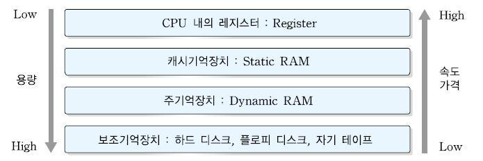

메모리는 한정된 희소 자원입니다.  
반면 데이터베이스가 메모리에 저장하고자 하는 데이터는 굉장히 많습니다.  
따라서 _데이터를 버퍼에 어떠한 식으로 확보할 것인가_ 하는 부분에서 트레이드 오프가 발생합니다.

## 1. 공짜 밥은 존재할까?

많은 데이터를 영속적으로 저장하려 하면 속도를 잃고, 속도를 얻고자 하면 많은 데이터를 영속적으로 저장하기 힘들다는 **트레이드오프**가 발생합니다.

---

## 2. DBMS와 기억장치의 관계

DBMS는 데이터 저장을 목적으로 하는 미들웨어입니다.  
DBMS가 사용하는 대표적인 기억장치

- 하드디스크(HDD)
  - 2차 기억장치
  - 용량과 성능에서 평균적인 수치를 가짐
- 메모리
  - 1차 기억장치
  - 기억 비용이 비쌈
    - DB 내부 데이터를 전부 메모리에 올리는 것은 불가능

### 버퍼를 활용한 속도 향상

DBMS는 데이터를 메모리에 올림으로써 디스크의 접근을 줄이고, SQL 구문의 실행 선능을 큰 폭으로 향상 시킵니다.

> 메모리와 디스크는 수십만 배에서 수백만 배의 성능 차이가 있습니다.

- 성능 향상을 목적으로 데이터를 저장하는 메모리를 **버퍼** 또는 **캐시**하고 부릅니다.
- 버퍼에 '데이터를 어떻게, 어느 정도의 기간 동안 올릴지' 관리하는 것이 DBMS의 **버퍼 매니저**입니다.

## 3. 메모리 위에 있는 두 개의 버퍼

- ### 데이터 캐시
  - 디스크의 데이터 일부를 메모리에 유지하기 위해 사용하는 메모리 영역
- ### 로그 버퍼
  - DBMS는 갱신과 관련된 SQL 구문을 받으면, 로그 버퍼에 변경 정보를 보냄, 이후에 로그 버퍼의 변경 사항 처리는 비동기로 처리함
    - 왜?
      - 저장소는 검색뿐만 아니라 갱신에도 시간을 소모함
      - 사용자는 갱신이 끝날 때까지 대기하게 됨
      - 따라서 갱신 정보를 받은 시점에서 사용자에게 갱신이 끝났음을 통지하고, 내부적으로 관련된 처리를 계속 수행함

## 4. 메모리 성질이 초래하는 트레이드 오프

- ### 휘발성
  - 시스템 장애 시 데이터가 모두 사라짐
    - 데이터 부정합을 발생
    - 비동기로 처리되는 갱신 정보 또한 사라짐
      - 이를 대비하고자 하는 디스크에 갱신 처리를 확정(커밋)해야함
      - 하지만 이는 디스크에 동기 접근이므로 여기서 지연 발생 가능성이 있음(트레이드오프)

## 5. 시스템 특성에 따른 트레이드 오프

- ### 데이터 캐시와 로그 버퍼의 크기
  - 초기값: 데이터 캐시 > 로그 버퍼 (약 3배)
    - 왜?
      - 데이터베이스는 기본적으로 검색을 메인으로 처리한다고 가정
      - 검색 처리 시 검색 대상 레코드 수 > 갱신 처리 시 갱신 대상
      - 자주 검색하는 데이터를 캐시에 올려놓는 것이 유리
- ### 검색과 갱신 중에서 중요한 것
  - 메모리는 비싼 희소 자원으로 모든 것을 커버하기엔 부족함
  - 데이터베이스가 어떠한 생각에 기반을 둬서 리소스를 배분하고 있는지를 이해해야함
- ### 추가적인 메모리 영역 '워킹 메모리'
  - 정렬 또는 해시 관련 처리에 사용되는 작업용 영역 **워킹 메모리**라고 부름
  - 언제 사용될까?
    - ORDER BY구, 집합 연산, 윈도우 함수 등의 기능을 사용할 때 실행됨
  - **워킹 메모리**는 임시 영역으로 필요할 때 사용되고, 종료되면 해체되는 임시 영역임
  - **워킹 메모리**는 여러 개의 SQL 구문들이 공유해서 사용함
  - 만약 **워킹 메모리**에서 다루려는 데이터양보다 작아진다면?
    - 부족한 만큼 저장소를 사용함
    - 저장소는 접근 속도가 느리기 때문에 처리 속도가 느려짐
